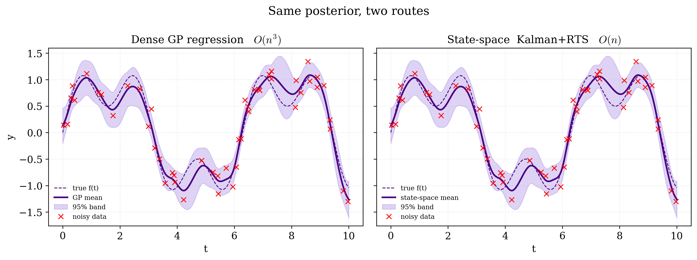
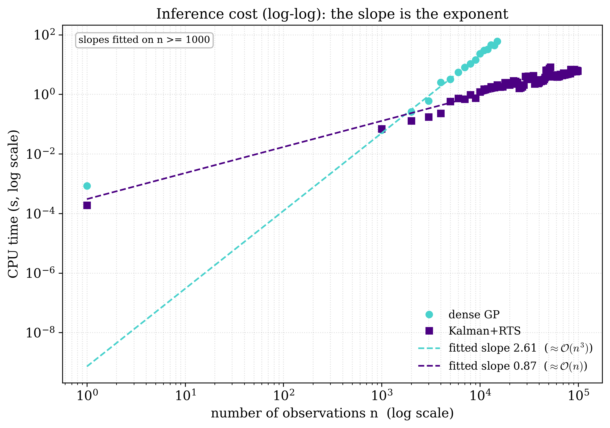

# Scalable Gaussian Process Regression through State-Space Formulations

Exact Gaussian process (GP) regression with a stationary one-dimensional kernel normally costs O(n^3) time and O(n^2) memory, because it inverts a dense n x n covariance matrix. This repository accompanies a Bachelor mathematics thesis (Vrije Universiteit Amsterdam) that rewrites a Matern-3/2 GP prior (smoothness nu = 3/2, p = 1) as a two-dimensional linear time-invariant stochastic differential equation, i.e. a linear-Gaussian state-space model. A forward Kalman filter followed by a backward Rauch--Tung--Striebel (RTS) smoother then returns the *exact same* GP posterior in O(n) time and O(n) memory. This is not an approximation: the two posteriors agree to machine precision. The code here lets you reproduce that equivalence and the resulting scaling behaviour.

## What this shows

Three headline results, all reproduced by the code in this repository:

1. **Posterior equivalence (to machine precision).** At n = 50 training points, the maximum absolute difference between the dense GP posterior and the state-space posterior is about 5.2e-15 (mean) and 3.2e-15 (standard deviation). The two methods compute the same thing.
2. **Asymptotic scaling matches theory.** Across a sweep in n, the fitted log-log slopes (fitted on n >= 1000) are 2.61 for the dense method, in line with its theoretical O(n^3), and 0.87 for the state-space method, in line with its theoretical O(n). These slopes are annotated directly on the figure below.
3. **Concrete speed-up.** The dense method runs out of room near n = 15000, where its O(n^2) memory becomes the limit; by that point its O(n^3) solve already takes about 60 s, against roughly 2 s for the filter-plus-smoother pass, and the gap keeps widening. The runtime curves cross around n = 1500: below that the dense solver's highly optimized linear algebra is faster, above it the linear-time method pulls ahead. In the figure the state-space method is measured far past the dense method's reach, out to about n = 100000.

<p align="center">
  
</p>

*Figure: the dense GP posterior and the state-space posterior plotted on the same axes. The means and 95% credible bands lie exactly on top of one another, illustrating result 1.*

<p align="center">
  
</p>

*Figure: inference runtime against the number of observations n, on log-log axes, where a power law t = c n^p is a straight line of slope p. The fitted slopes (on n >= 1000) are 2.61 for the dense method, near its O(n^3), and 0.87 for the state-space method, near its O(n), illustrating results 2 and 3.*

## Repository layout

```
scalable-gp-state-space/
├── Experiments.ipynb        Self-contained notebook reproducing every thesis figure
│                            (re-implements the filter/smoother inline; uses filterpy)
├── code/                    Modular, heavily commented version of the same method
│   ├── config.py            Hyperparameters and experiment settings in one place
│   ├── data.py              Synthetic dataset f(t) = sin t + 0.5 sin 3t plus Gaussian noise
│   ├── matern_ssm.py        Matern-3/2 GP as an LTI SDE and its discrete state-space matrices;
│   │                        __main__ cross-checks the closed forms against scipy (< 1e-10)
│   ├── dense_gpr.py         O(n^3) dense GP baseline via scikit-learn (ground truth)
│   ├── kalman_rts.py        O(n) Kalman filter + RTS smoother from scratch, joint posterior
│   │                        covariance recursion, and the log marginal likelihood
│   └── experiments/         Scripts that save individual figures
│       ├── fig_equivalence.py
│       ├── fig_error.py
│       ├── fig_samples.py
│       └── fig_scalability.py
├── Graphs/                  PNG figures used in the thesis (e.g. 07_gp_vs_statespace.png,
│                            09b_inference_cost_loglog.png, 10_matern_kernel.png, ...)
├── pyproject.toml
├── requirements.txt
├── LICENSE
└── .gitignore
```

The notebook and the `code/` package are two independent paths to the same result. `Experiments.ipynb` is the main artifact and reproduces every figure in the thesis; it does not import the `code/` package but re-implements the filter and smoother inline. The `code/` package is a tidy, modular reference version of the method. The thesis text itself is not included in this repository.

## Getting started

The notebook and the `code/` package have slightly different dependencies: the notebook additionally needs `filterpy` (it uses `filterpy.kalman.KalmanFilter` and `rts_smoother`), while the `code/` package depends only on NumPy, SciPy, scikit-learn and Matplotlib. The supplied `requirements.txt` covers both. Python 3.12 or newer is required.

Create and activate a virtual environment, then install the requirements.

On Linux or macOS:

```bash
python -m venv .venv
source .venv/bin/activate
pip install -r requirements.txt
```

On Windows (PowerShell):

```powershell
python -m venv .venv
.\.venv\Scripts\Activate.ps1
pip install -r requirements.txt
```

`requirements.txt` lists:

```
numpy>=2.0
scipy>=1.13
scikit-learn>=1.5
matplotlib>=3.9
filterpy>=1.4.5
jupyter>=1.0
```

### Running the notebook

With the environment active and the requirements installed (the notebook needs `filterpy`, which is included above), launch Jupyter and open the notebook:

```bash
jupyter notebook Experiments.ipynb
```

Running all cells top to bottom reproduces every figure in the thesis.

### Running the `code/` scripts

The scripts in `code/` import sibling modules by name (for example `from config import ...`), so run them with `code/` as the working directory. From the repository root:

```bash
cd code

# Verify the closed-form state-space matrices against scipy (asserts agreement < 1e-10)
python matern_ssm.py

# Quick run of the state-space pipeline (prints the log marginal likelihood and a few values)
python kalman_rts.py

# Plot the dense GP baseline posterior
python dense_gpr.py
```

The figure scripts add the package directory to `sys.path` themselves, so they can be run directly from the repository root:

```bash
python code/experiments/fig_equivalence.py
python code/experiments/fig_error.py
python code/experiments/fig_samples.py
python code/experiments/fig_scalability.py
```

Each figure script also prints the quantitative discrepancy it measures (for example the maximum absolute difference between the dense and state-space posteriors) before saving its plot.

## Reproducing the figures

The polished figures shipped in `Graphs/` are produced by `Experiments.ipynb`. The `code/experiments/` scripts produce simpler standalone versions of the same comparisons and save them next to themselves in `code/experiments/`.

| Result | Thesis figure (`Graphs/`) | Notebook | Standalone script | Script output |
|---|---|---|---|---|
| Dense GP posterior baseline | `02_gp_posterior.png` | `Experiments.ipynb` | `code/dense_gpr.py` (`__main__`) | `code/experiments/baseline_posterior.png` |
| Posterior equivalence (means and bands coincide) | `07_gp_vs_statespace.png` | `Experiments.ipynb` | `code/experiments/fig_equivalence.py` | `code/experiments/equivalence.png` |
| Pointwise discrepancy (~1e-15, full covariance) | (within the equivalence analysis) | `Experiments.ipynb` | `code/experiments/fig_error.py` | `code/experiments/error.png` |
| Joint posterior samples (shared random draws) | (within the equivalence analysis) | `Experiments.ipynb` | `code/experiments/fig_samples.py` | `code/experiments/samples.png` |
| Inference cost vs n (linear and log scales) | `08_inference_cost.png`, `09_inference_cost_log.png`, `09b_inference_cost_loglog.png` | `Experiments.ipynb` | `code/experiments/fig_scalability.py` | `code/experiments/scalability.png` |
| Matern-3/2 kernel and spectral density | `10_matern_kernel.png`, `11_matern_spectral_density.png` | `Experiments.ipynb` | (notebook only) | — |

The remaining figures in `Graphs/` (data, filter and smoother snapshots, and the parametric-versus-nonparametric motivation) are produced by `Experiments.ipynb`.

The standalone scripts in `code/experiments/` use a smaller scaling sweep than the notebook figures, so the timing numbers they report depend on hardware and will not reproduce the headline values exactly. The qualitative conclusions (the slopes and the crossover) hold regardless.

### Experiment settings

All experiments share one synthetic problem. The ground-truth function is `f(t) = sin(t) + 0.5 sin(3t)`, observed as `y_i = f(t_i) + noise` with noise standard deviation 0.2, inputs drawn uniformly on `[0, 10]` (seed 0) and sorted ascending. Sorting matters for the state-space method, which steps through time in order, and is irrelevant to the dense baseline. For the headline runs the kernel hyperparameters were fitted once by the dense GP, giving sigma^2 = 0.78 and length-scale ell = 1.06. (The defaults in `code/config.py` are sigma^2 = 1.0 and ell = 1.0, kept fixed for the modular code path.)

Exact wall-clock numbers depend on the machine and the installed package versions; the thesis reports its timings on an Intel Core i7-1255U with 16 GB RAM running Windows 11. What is hardware-independent is the *shape* of the curves: the fitted slopes near 3 and 1, and the crossover.

## Method in one paragraph

A Matern-3/2 GP prior is equivalent to the solution of a second-order scalar stochastic differential equation, which in companion form becomes a first-order linear time-invariant SDE `dx/dt = F x + L w(t)` with a two-dimensional state `x(t) = (f(t), f'(t))` and observation `f(t) = H x(t)`. Sampling this SDE at the (sorted) observation times yields a discrete linear-Gaussian state-space model `x_k = A_k x_{k-1} + q_k`, with the transition matrix `A_k = exp(F dt)` and the process-noise covariance `Q_k = P_inf - A_k P_inf A_k^T` available in closed form (`matern_ssm.py` derives these and checks them against `scipy.linalg.expm` and the Lyapunov solver). A forward Kalman filter passes through the data once to compute the filtering posterior, and a backward RTS smoother turns that into the smoothing posterior conditioned on all observations, which is precisely the GP posterior. Because the state dimension m = 2 is fixed, the whole pass costs O(n m^3) = O(n) in time and memory. Test points are handled as missing observations on a merged, sorted train-plus-test grid (prediction step only), so the posterior is available at arbitrary inputs, and the filter accumulates the exact log marginal likelihood for later hyperparameter optimisation.

## Thesis

This repository accompanies the thesis **"Scalable Gaussian Process Regression through State-Space Formulations"**, Bachelor of Mathematics, Vrije Universiteit Amsterdam.

- Author: Andreas Alexandrou (a.alexandrou2@student.vu.nl)
- Supervisor: prof. dr. ir. Frank van der Meulen
- Repository: https://github.com/andreasalexandrou21/scalable-gp-state-space

## How to cite

If you use this code or build on the thesis, please cite it:

```bibtex
@thesis{alexandrou2026scalablegp,
  author      = {Andreas Alexandrou},
  title       = {Scalable Gaussian Process Regression through State-Space Formulations},
  school      = {Vrije Universiteit Amsterdam},
  type        = {Bachelor's thesis},
  year        = {2026},
  note        = {Supervised by prof. dr. ir. Frank van der Meulen},
  url         = {https://github.com/andreasalexandrou21/scalable-gp-state-space}
}
```

## License

Released under the MIT License. Copyright (c) 2026 Andreas Alexandrou. See [LICENSE](LICENSE) for the full text.
